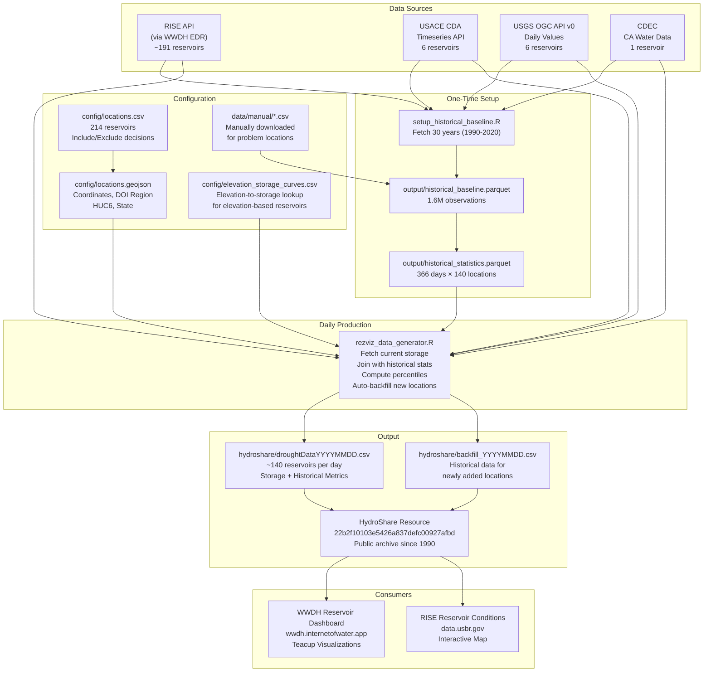
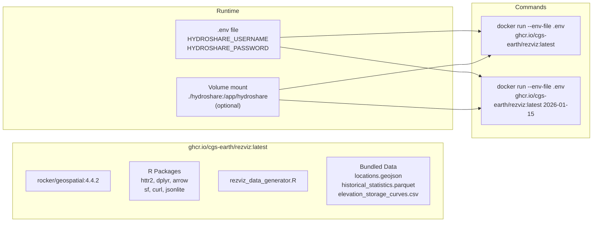
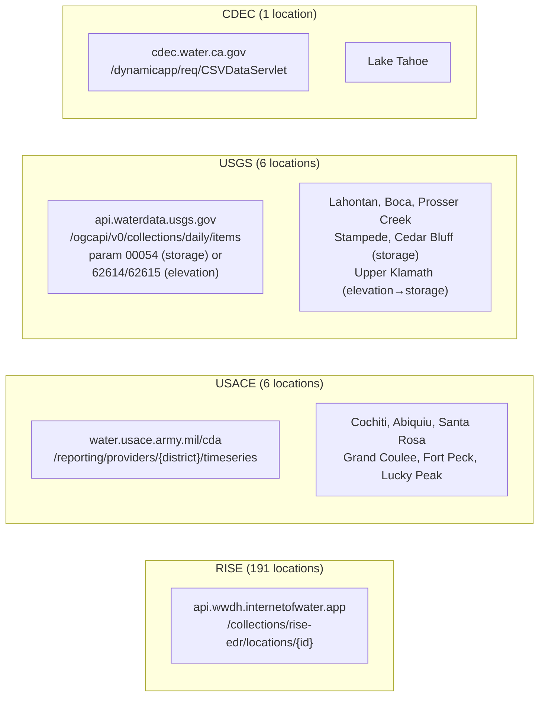
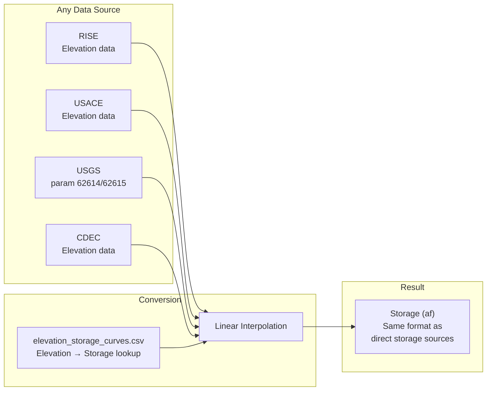
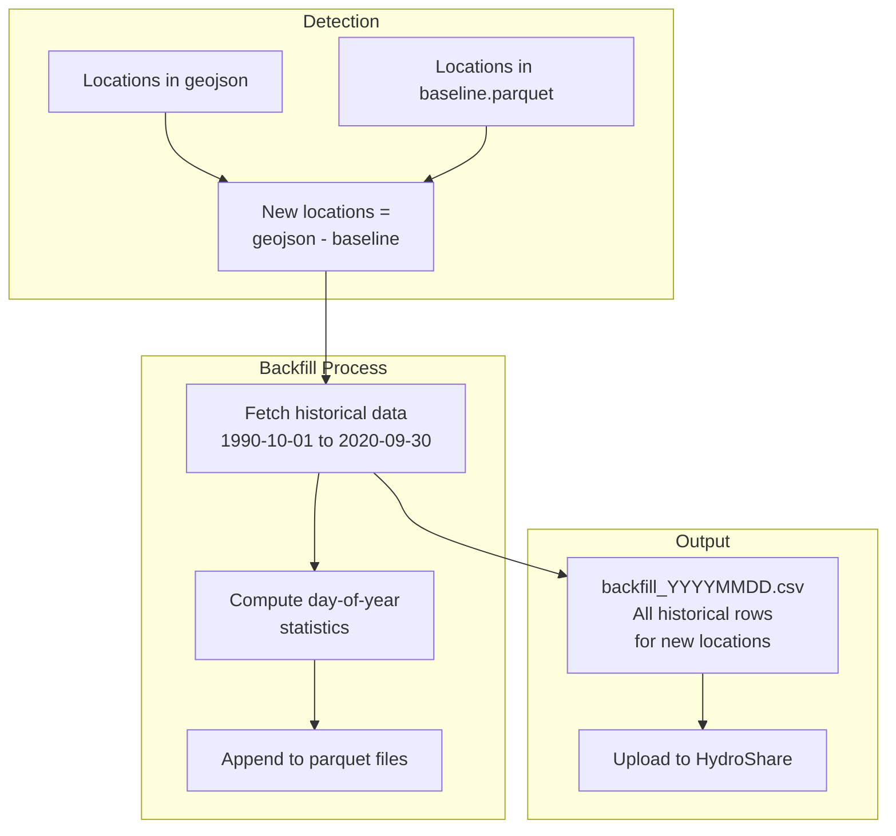
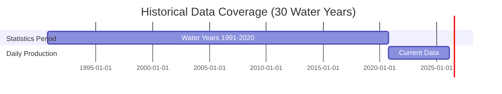

# R-Workflow Architecture Diagram

## Data Pipeline Overview

## Docker Deployment

## Data Sources Detail

## Output CSV Schema

| Column | Description | Example |
|--------|-------------|---------|
| SiteName | Display name | "Lake Powell (Glen Canyon Dam)" |
| Lat, Lon | Coordinates | 37.0706, -111.4850 |
| State | State code | "AZ" |
| DoiRegion | DOI region | "Upper Colorado Basin" |
| Huc6 | Watershed | "140700" |
| DataUnits | Units | "af" |
| DataValue | Current storage | 7234567 |
| DataDate | Observation date | "02/09/2026" |
| DateQueried | Query date | "02/10/2026" |
| DataDateMax | Historical max | 24322000 |
| DataDateP90 | 90th percentile | 18234567 |
| DataDateP75 | 75th percentile | 15234567 |
| DataDateP50 | Median | 12234567 |
| DataDateP25 | 25th percentile | 9234567 |
| DataDateP10 | 10th percentile | 6234567 |
| DataDateMin | Historical min | 3234567 |
| DataDateAvg | Historical mean | 11234567 |
| DataValuePctMdn | Current/Median | 0.59 |
| DataValuePctAvg | Current/Average | 0.64 |
| StatsPeriod | Stats period | "10/1/1990 - 9/30/2020" |
| MaxCapacity | Dam capacity | 24322000 |
| PctFull | Current/Capacity | 0.30 |
| DataUrl | API endpoint | "https://api.wwdh..." |

## Elevation-to-Storage Conversion

For reservoirs that report water surface elevation instead of storage volume (e.g., Upper Klamath Lake), the workflow converts elevation to storage using lookup tables. This is supported for **all data sources** (RISE, USACE, USGS, CDEC).

**Current elevation-based locations:**
- Upper Klamath Lake (USGS 11507001) - 2017 KBAO elevation-capacity curve

**To add elevation-based reservoir from any source:**
1. Add elevation-storage curve to `config/elevation_storage_curves.csv`
2. Set `Storage Data Type = Elevation` in `config/locations.csv`

## Auto-Backfill Process

When a new location appears in `locations.geojson` but is not in `historical_baseline.parquet`, the daily script automatically backfills historical data.

**Triggers:**
- Newly added reservoirs in `locations.csv`
- Status change from "Do Not Include" to "Include"

## Historical Statistics Period

