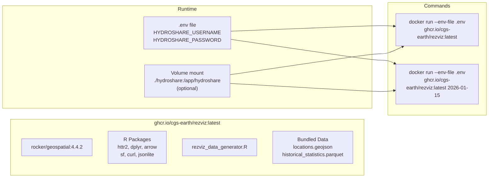
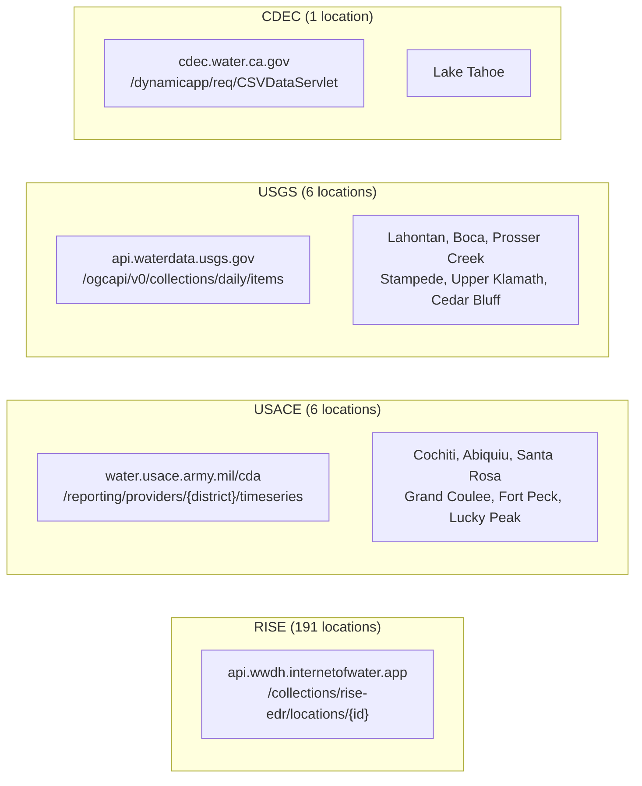

# R-Workflow Architecture Diagram

## Data Pipeline Overview

```mermaid
flowchart TB
    subgraph sources["Data Sources"]
        RISE["RISE API<br/>(via WWDH EDR)<br/>~191 reservoirs"]
        USACE["USACE CDA<br/>Timeseries API<br/>6 reservoirs"]
        USGS["USGS OGC API v0<br/>Daily Values<br/>6 reservoirs"]
        CDEC["CDEC<br/>CA Water Data<br/>1 reservoir"]
    end

    subgraph config["Configuration"]
        CSV["config/locations.csv<br/>214 reservoirs<br/>Include/Exclude decisions"]
        GEOJSON["config/locations.geojson<br/>Coordinates, DOI Region<br/>HUC6, State"]
        MANUAL["data/manual/*.csv<br/>Manually downloaded<br/>for problem locations"]
    end

    subgraph setup["One-Time Setup"]
        BASELINE["setup_historical_baseline.R<br/>Fetch 30 years (1990-2020)"]
        HIST_DATA["output/historical_baseline.parquet<br/>1.6M observations"]
        HIST_STATS["output/historical_statistics.parquet<br/>366 days × 140 locations"]
    end

    subgraph daily["Daily Production"]
        GENERATOR["rezviz_data_generator.R<br/>Fetch current storage<br/>Join with historical stats<br/>Compute percentiles"]
    end

    subgraph output["Output"]
        DAILY_CSV["hydroshare/droughtDataYYYYMMDD.csv<br/>~140 reservoirs per day<br/>Storage + Historical Metrics"]
        HYDROSHARE["HydroShare Resource<br/>22b2f10103e5426a837defc00927afbd<br/>Public archive since 1990"]
    end

    subgraph consumers["Consumers"]
        WWDH["WWDH Reservoir Dashboard<br/>wwdh.internetofwater.app<br/>Teacup Visualizations"]
        RISE_VIZ["RISE Reservoir Conditions<br/>data.usbr.gov<br/>Interactive Map"]
    end

    %% Data flow for setup
    RISE --> BASELINE
    USACE --> BASELINE
    USGS --> BASELINE
    CDEC --> BASELINE
    BASELINE --> HIST_DATA
    HIST_DATA --> HIST_STATS

    %% Data flow for daily
    RISE --> GENERATOR
    USACE --> GENERATOR
    USGS --> GENERATOR
    CDEC --> GENERATOR
    HIST_STATS --> GENERATOR
    GEOJSON --> GENERATOR
    GENERATOR --> DAILY_CSV
    DAILY_CSV --> HYDROSHARE

    %% Consumers
    HYDROSHARE --> WWDH
    HYDROSHARE --> RISE_VIZ

    %% Config relationships
    CSV --> GEOJSON
    MANUAL --> HIST_DATA
```

## Docker Deployment

## Data Sources Detail

## Output CSV Schema

| Column | Description | Example |
|--------|-------------|---------|
| SiteName | Display name | "Lake Powell (Glen Canyon Dam)" |
| Lat, Lon | Coordinates | 37.0706, -111.4850 |
| State | State code | "AZ" |
| DoiRegion | DOI region | "Upper Colorado Basin" |
| Huc6 | Watershed | "140700" |
| DataUnits | Units | "af" |
| DataValue | Current storage | 7234567 |
| DataDate | Observation date | "02/09/2026" |
| DateQueried | Query date | "02/10/2026" |
| DataDateMax | Historical max | 24322000 |
| DataDateP90 | 90th percentile | 18234567 |
| DataDateP75 | 75th percentile | 15234567 |
| DataDateP50 | Median | 12234567 |
| DataDateP25 | 25th percentile | 9234567 |
| DataDateP10 | 10th percentile | 6234567 |
| DataDateMin | Historical min | 3234567 |
| DataDateAvg | Historical mean | 11234567 |
| DataValuePctMdn | Current/Median | 0.59 |
| DataValuePctAvg | Current/Average | 0.64 |
| StatsPeriod | Stats period | "10/1/1990 - 9/30/2020" |
| MaxCapacity | Dam capacity | 24322000 |
| PctFull | Current/Capacity | 0.30 |
| DataUrl | API endpoint | "https://api.wwdh..." |

## Historical Statistics Period

