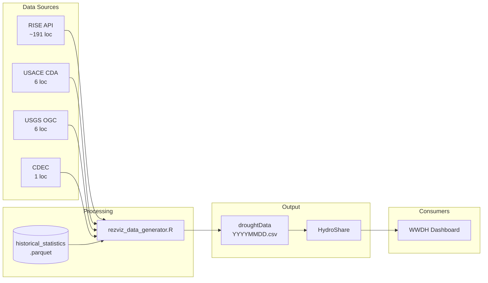

# WWDH Reservoir Visualization Data Generator - R Implementation

R workflow for generating reservoir conditions data for the WWDH Reservoir Dashboard teacup diagrams. Fetches current storage data from multiple sources (RISE, USACE, USGS, CDEC), computes historical statistics, generates daily output CSVs, and uploads to HydroShare.

## Directory Structure

```
R-workflow/
├── config/                     # User-curated configuration
│   ├── locations.csv           # Master reservoir list (input)
│   └── locations.geojson       # Generated with coordinates & spatial attributes
│
├── data/
│   ├── manual/                 # Manually downloaded CSVs for problem locations
│   │   └── {location_id}.csv   # e.g., 267.csv, 282.csv, 489.csv
│   │
│   └── reference/              # Large reference datasets for lookups
│       ├── doiRegions.geojson  # DOI region boundaries
│       ├── huc6.geojson        # HUC6 watershed boundaries
│       ├── states.geojson      # State boundaries
│       ├── rise.geojson        # RISE locations with coordinates
│       ├── nid.csv             # National Inventory of Dams
│       └── loc.csv             # Intermediate locations data
│
├── examples/                   # Test/example outputs for visualization
│   ├── reservoirs_*.geojson    # Dummy data files for dashboard testing
│   └── locations_map.html      # Interactive map of all locations
│
├── output/                     # Generated data (git-tracked)
│   ├── historical_baseline.parquet   # Raw historical observations
│   ├── historical_statistics.parquet # Day-of-year statistics (primary)
│   ├── historical_statistics.csv     # Day-of-year statistics (backup)
│   └── failed_locations.txt          # Locations that failed API fetch
│
├── hydroshare/                 # HydroShare staging (git-ignored)
│   ├── readme.md               # HydroShare resource description
│   └── droughtDataYYYYMMDD.csv # Daily output CSV (uploaded to HydroShare)
│
├── Dockerfile                  # Docker build for daily production runs
├── .dockerignore               # Docker build exclusions
├── .env                        # HydroShare credentials (git-ignored)
└── Scripts (see below)
```

## Scripts

### One-Time Setup Scripts

| Script | Purpose |
|--------|---------|
| `setup_historical_baseline.R` | Fetch 30 years of historical data (1990-2020) from RISE API for all locations. Creates `historical_baseline.parquet` and `historical_statistics.parquet`. |
| `process_manual_csvs.R` | Process manually downloaded CSVs for locations that failed API fetch. Adds them to the historical baseline. |
| `create_locations_geojson.R` | Generate `locations.geojson` from `locations.csv` by merging coordinates from RISE/NID and performing spatial joins for DOI region, HUC6, and state. |
| `fetch_489_by_year.R` | Utility script to fetch location 489 data year-by-year (workaround for API timeout). |
| `check_failed_locations.R` | Diagnostic script to analyze failed locations and categorize by decision type. |

### Daily Production Script

| Script | Purpose |
|--------|---------|
| `rezviz_data_generator.R` | **Main daily script.** Fetches current storage values, joins with historical statistics, generates output CSV. Run via cron. |

### Utility Scripts

| Script | Purpose |
|--------|---------|
| `create_dummy_geojson.R` | Generate test geojson files with dummy storage values for dashboard visualization testing. |
| `helper_functions.R` | Shared helper functions (API retry logic, etc.). |

## Workflow

### Initial Setup (One-Time)

1. **Prepare `config/locations.csv`** with reservoir metadata including RISE Location IDs

2. **Fetch historical data:**
   ```bash
   Rscript setup_historical_baseline.R
   ```
   This takes several hours. Failed locations are logged to `output/failed_locations.txt`.

3. **Handle failed locations** by manually downloading CSVs from RISE and placing in `data/manual/`:
   ```bash
   Rscript process_manual_csvs.R
   ```

4. **Generate locations.geojson** (requires reference data in `data/reference/`):
   ```bash
   Rscript create_locations_geojson.R
   ```

### Daily Production

Run the daily generator script (schedule via cron for automation):

```bash
# For yesterday's data (default)
Rscript rezviz_data_generator.R

# For a specific date
Rscript rezviz_data_generator.R 2025-01-15
```

Output: `hydroshare/droughtDataYYYYMMDD.csv` (also uploaded to HydroShare)

### Docker

The daily script is containerized for portable, reproducible runs. The image is based on `rocker/geospatial:4.4.2` and bundles all R dependencies, the location metadata, and historical statistics.

**Build:**

```bash
cd R-workflow
docker build -t rezviz .
```

**Run:**

```bash
# Yesterday's data (default)
docker run --env-file .env rezviz

# Arbitrary date
docker run --env-file .env rezviz 2026-01-15

# Keep the CSV locally via volume mount
docker run --env-file .env -v $(pwd)/hydroshare:/app/hydroshare rezviz 2026-01-15
```

HydroShare credentials are passed at runtime via `--env-file .env` (never baked into the image). The `.env` file should contain:

```
HYDROSHARE_USERNAME=user@example.com
HYDROSHARE_PASSWORD=yourpassword
```

## Historical Statistics

Statistics are computed for each location and each day-of-year (366 rows per location) based on the 30-year period October 1, 1990 through September 30, 2020.

For each calendar day, the following are computed:
- Percentiles: 10th, 25th, 50th (median), 75th, 90th
- Mean and min/max
- Observation count

## API Notes

### Data Sources

| Source | API | Locations |
|--------|-----|-----------|
| **RISE** | [WWDH EDR API](https://api.wwdh.internetofwater.app/collections/rise-edr) | ~201 reservoirs |
| **USACE** | [CDA Timeseries API](https://water.usace.army.mil) | Cochiti, Abiquiu, Santa Rosa, Grand Coulee, Fort Peck, Lucky Peak |
| **USGS** | [NWIS Daily Values](https://waterservices.usgs.gov/nwis/dv/) | Lahontan, Boca, Prosser Creek, Stampede |
| **CDEC** | [CDEC CSV Servlet](https://cdec.water.ca.gov) | Lake Tahoe |

### WWDH EDR API

Base URL: `https://api.wwdh.internetofwater.app`

The EDR (Environmental Data Retrieval) API has a quirk where the `datetime` parameter's end date is **exclusive**. To include data for a specific date, request the day after:

```
# To get data for 2025-01-15, request:
datetime=2025-01-15/2025-01-16
```

### Rate Limiting

Scripts include 0.25-0.5 second delays between API calls to avoid overwhelming the server.

## Output Format

The daily CSV contains columns compatible with the original .NET teacup generator:

| Column | Description |
|--------|-------------|
| SiteName | Reservoir display name |
| Lat, Lon | Coordinates |
| State, DoiRegion, Huc6 | Spatial attributes |
| DataUnits | Units (typically acre-feet) |
| DataValue | Current storage value |
| DataDate | Date of observation |
| DateQueried | Date script was run |
| DataDateP10-P90 | Historical percentiles for this day-of-year |
| DataDateMin, DataDateMax | Historical extremes |
| DataDateAvg | Historical mean |
| DataValuePctMdn | Current / median (decimal) |
| DataValuePctAvg | Current / average (decimal) |
| StatsPeriod | "10/1/1990 - 9/30/2020" |
| MaxCapacity | Reservoir capacity |
| PctFull | Current / capacity (decimal) |
| TeacupUrl | URL to teacup graphic (reserved) |
| DataUrl | Exact API URL used to fetch the current value |
| Comment | Additional notes |

## Requirements

```r
# Core packages
library(httr2)      # API requests
library(dplyr)      # Data manipulation
library(readr)      # CSV I/O
library(lubridate)  # Date handling
library(arrow)      # Parquet I/O
library(stringr)    # String manipulation
library(sf)         # Spatial data (requires GEOS, GDAL, PROJ)
library(curl)       # Multipart file upload (HydroShare)
```

Or use the provided Dockerfile which bundles all dependencies.

## Architecture Diagram

See [architecture-diagram.md](architecture-diagram.md) for detailed diagrams of the data pipeline.



## Current Status

- **214 reservoirs** in the locations list
- **140 locations** with current data (RISE + USACE + USGS + CDEC)
- **136 locations** with complete historical statistics

Locations without historical statistics can still be visualized with current storage values, but won't have historical comparison metrics (percentiles, percent of average, etc.).
