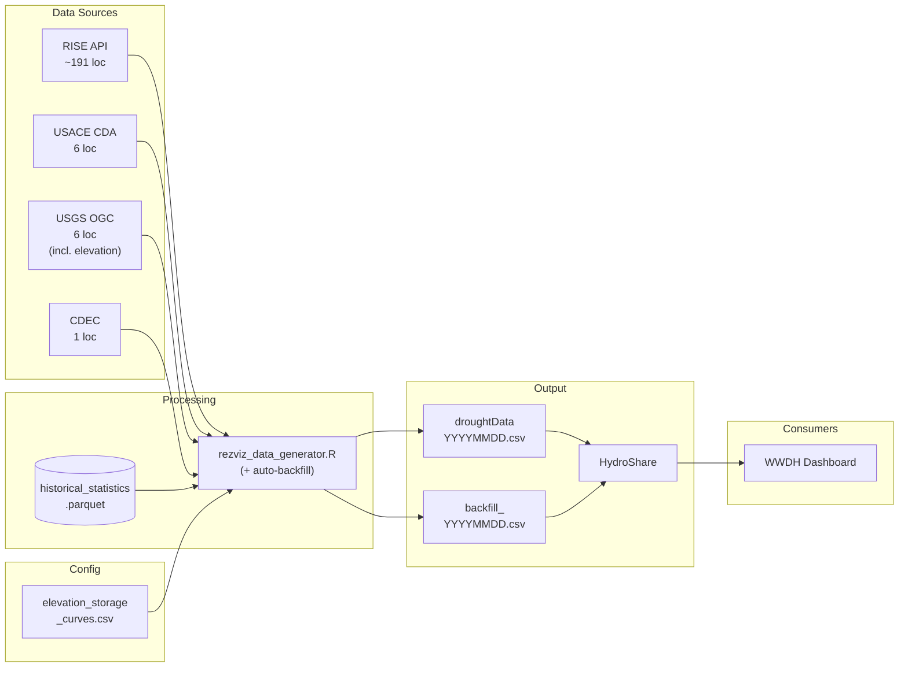

# WWDH Reservoir Visualization Data Generator - R Implementation

R workflow for generating reservoir conditions data for the WWDH Reservoir Dashboard teacup diagrams. Fetches current storage data from multiple sources (RISE, USACE, USGS, CDEC), computes historical statistics, generates daily output CSVs, and uploads to HydroShare.

## Directory Structure

```
R-workflow/
├── config/                     # User-curated configuration
│   ├── locations.csv           # Master reservoir list (input)
│   ├── locations.geojson       # Generated with coordinates & spatial attributes
│   └── elevation_storage_curves.csv  # Elevation-to-storage lookup tables
│
├── data/
│   ├── manual/                 # Manually downloaded CSVs for problem locations
│   │   └── {location_id}.csv   # e.g., 267.csv, 282.csv, 489.csv
│   │
│   └── reference/              # Large reference datasets for lookups
│       ├── doiRegions.geojson  # DOI region boundaries
│       ├── huc6.geojson        # HUC6 watershed boundaries
│       ├── states.geojson      # State boundaries
│       ├── rise.geojson        # RISE locations with coordinates
│       └── nid.csv             # National Inventory of Dams
│
├── examples/                   # Test/example outputs for visualization
│   ├── reservoirs_*.geojson    # Dummy data files for dashboard testing
│   └── locations_map.html      # Interactive map of all locations
│
├── output/                     # Generated data (git-tracked)
│   ├── historical_baseline.parquet   # Raw historical observations
│   ├── historical_statistics.parquet # Day-of-year statistics (primary)
│   ├── historical_statistics.csv     # Day-of-year statistics (backup)
│   └── failed_locations.txt          # Locations that failed API fetch
│
├── hydroshare/                 # HydroShare staging (git-ignored)
│   ├── readme.md               # HydroShare resource description
│   └── droughtDataYYYYMMDD.csv # Daily output CSV (uploaded to HydroShare;
│                               #   new-location + staged gap-fill rows merged in)
│
├── Dockerfile                  # Docker build for daily production runs
├── .dockerignore               # Docker build exclusions
├── .env                        # HydroShare credentials (git-ignored)
└── Scripts (see below)
```

## Scripts

### One-Time Setup Scripts

| Script | Purpose |
|--------|---------|
| `setup_historical_baseline.R` | Fetch 30 years of historical data (1990-2020) from all sources. Creates `historical_baseline.parquet` and `historical_statistics.parquet`. |
| `process_manual_csvs.R` | Process manually downloaded CSVs for locations that failed API fetch. Adds them to the historical baseline. |
| `create_locations_geojson.R` | Generate `locations.geojson` from `config/locations.csv` by merging coordinates from RISE/NID and performing spatial joins for DOI region, HUC6, and state. Runs automatically via GitHub Actions when `locations.csv` changes. |

### Daily Production Script

| Script | Purpose |
|--------|---------|
| `rezviz_data_generator.R` | **Main daily script.** Fetches current storage values, joins with historical statistics, generates output CSV, uploads to HydroShare. **Auto-detects new locations and generates backfill data.** |

### Utility Scripts

| Script | Purpose |
|--------|---------|
| `backfill_history.R` | **Monthly history backfill.** Downloads the entire available record for every reservoir, finds observations missing from `historical_baseline.parquet`, fetches and appends them, recomputes the affected day-of-year statistics, and uploads the refreshed parquet files to HydroShare. See [Monthly History Backfill](#monthly-history-backfill). |
| `backfill_reports.R` | Generate historical daily CSVs by combining historical baseline with recent data. Batch uploads to HydroShare. |
| `create_dummy_geojson.R` | Generate test geojson files with dummy storage values for dashboard visualization testing. |
| `helper_functions.R` | Shared helpers: elevation→storage curves, `classify_source()`, `calculate_daily_stats()`, and `fetch_full_history()` (the per-source full-record fetcher used by both the daily auto-backfill and `backfill_history.R`). |

## Workflow

### Initial Setup (One-Time)

1. **Prepare `config/locations.csv`** with reservoir metadata including RISE Location IDs

2. **Fetch historical data:**
   ```bash
   Rscript setup_historical_baseline.R
   ```
   This takes several hours. Failed locations are logged to `output/failed_locations.txt`.

3. **Handle failed locations** by manually downloading CSVs from RISE and placing in `data/manual/`:
   ```bash
   Rscript process_manual_csvs.R
   ```

4. **Generate locations.geojson** (requires reference data in `data/reference/`):
   ```bash
   Rscript create_locations_geojson.R
   ```

### Daily Production

Run the daily generator script (schedule via cron for automation):

```bash
# For yesterday's data (default)
Rscript rezviz_data_generator.R

# For a specific date
Rscript rezviz_data_generator.R 2025-01-15
```

Each run publishes the **last 7 days** of data (`REPORT_DAYS = 7`): the target
date plus the previous six days, each row carrying the most recent value on or
before that calendar day. A wider 14-day fetch window (`LOOKBACK_DAYS = 14`)
ensures every report date still resolves even when a source has a multi-day gap.

Output: `hydroshare/droughtDataYYYYMMDD.csv` (also uploaded to HydroShare)

### Docker

The daily script is containerized for portable, reproducible runs. The image is based on `rocker/geospatial:4.4.2` and bundles all R dependencies and location metadata.

**Note:** Historical parquet files are downloaded from HydroShare during Docker build. If new locations are backfilled at runtime, updated parquet files are uploaded to HydroShare. Rebuild the image to incorporate the latest backfills.

**Build:**

```bash
cd R-workflow
docker build -t rezviz .
```

**Run:**

```bash
# Yesterday's data (default)
docker run --env-file .env rezviz

# Arbitrary date
docker run --env-file .env rezviz 2026-01-15

# Keep the CSV locally via volume mount
docker run --env-file .env -v $(pwd)/hydroshare:/app/hydroshare rezviz 2026-01-15
```

HydroShare credentials are passed at runtime via `--env-file .env` (never baked into the image). The `.env` file should contain:

```
HYDROSHARE_USERNAME=user@example.com
HYDROSHARE_PASSWORD=yourpassword
```

**Data Flow:**
1. Docker build downloads parquet files from HydroShare (bundled as baseline fallback)
2. On each run, script downloads latest parquet files from HydroShare (overwriting bundled files)
3. If new locations are detected, historical data is backfilled
4. Updated parquet files are uploaded to HydroShare
5. Next run downloads the updated parquet files automatically - no image rebuild needed

## Historical Statistics

Statistics are computed for each location and each day-of-year (366 rows per location) based on the 30-year period October 1, 1990 through September 30, 2020.

For each calendar day, the following are computed:
- Percentiles: 10th, 25th, 50th (median), 75th, 90th
- Mean and min/max
- Observation count

## API Notes

### Data Sources

| Source | API | Locations |
|--------|-----|-----------|
| **RISE** | [WWDH EDR API](https://api.wwdh.internetofwater.app/collections/rise-edr) | ~201 reservoirs |
| **USACE** | [CDA Timeseries API](https://water.usace.army.mil) | Cochiti, Abiquiu, Santa Rosa, Grand Coulee, Fort Peck, Lucky Peak |
| **USGS** | [NWIS Daily Values](https://waterservices.usgs.gov/nwis/dv/) | Lahontan, Boca, Prosser Creek, Stampede |
| **CDEC** | [CDEC CSV Servlet](https://cdec.water.ca.gov) | Lake Tahoe |

### WWDH EDR API

Base URL: `https://api.wwdh.internetofwater.app`

The EDR (Environmental Data Retrieval) API has a quirk where the `datetime` parameter's end date is **exclusive**. To include data for a specific date, request the day after:

```
# To get data for 2025-01-15, request:
datetime=2025-01-15/2025-01-16
```

### Rate Limiting

Scripts include 0.25-0.5 second delays between API calls to avoid overwhelming the server.

### Elevation Data (Special Handling)

Some reservoirs (like Upper Klamath Lake) report **water surface elevation** rather than storage volume. The workflow automatically detects these locations (via `Storage Data Type = Elevation` in locations.csv) and converts elevation to storage using lookup tables.

**Elevation-Storage Curves** are defined in `config/elevation_storage_curves.csv`:

```csv
location_id,elevation_ft,storage_af
11507001,4136.00,0
11507001,4137.00,66775
11507001,4138.00,134367
...
```

The workflow uses linear interpolation between curve points. Elevation-to-storage conversion is supported for all data sources (RISE, USACE, USGS, CDEC), making it easy to add any reservoir that reports elevation instead of storage.

For USGS specifically, elevation data queries parameter codes 62614 (NGVD29) or 62615 (NAVD88) instead of 00054 (storage).

**Current elevation locations:**
- Upper Klamath Lake (USGS 11507001) - uses 2017 KBAO elevation-capacity curve

To add a new elevation-based reservoir from any source:
1. Add the elevation-storage curve to `config/elevation_storage_curves.csv`
2. Set `Storage Data Type = Elevation` in `config/locations.csv`

## Auto-Backfill for New Locations

When the daily script detects a new location (present in `locations.geojson` but not in `historical_baseline.parquet`), it automatically:

1. **Fetches the location's full historical record** (back to 1870 where the source has it; statistics are still computed over 1990-2020) from the appropriate source
2. **Computes day-of-year statistics** and appends to the parquet files
3. **Renders those historical rows** in the daily CSV schema with `Comment = "backfill"` (via the shared `build_drought_csv_rows()` helper)
4. **Merges them directly into that day's `droughtDataYYYYMMDD.csv`** — they are *not* written to a separate file

This handles two scenarios:
- **Newly added reservoirs** in `locations.csv`
- **Status changes** from "Do Not Include" to "Include"

> **How the history reaches the database.** The downstream PostgreSQL loader
> ([Western-Water-Datahub `teacup`](https://github.com/cgs-earth/Western-Water-Datahub))
> ingests **only `droughtDataYYYYMMDD.csv` files** — never the parquet files — and keys
> each row on its own `DataDate`. Merging the backfill rows inline into the daily CSV is
> therefore the mechanism by which historical observations reach the database. (There is
> no separate `backfill_YYYYMMDD.csv`; the loader would not read one.)

## Monthly History Backfill

The daily script's auto-backfill only fires for **brand-new** locations. Existing
locations can still develop gaps in their record — for example, when a source API
is briefly unavailable on the day the daily run queried it. `backfill_history.R`
sweeps **every** reservoir to fill those gaps.

On each run it:

1. **Downloads** the latest `historical_baseline.parquet` and
   `historical_statistics.parquet` from HydroShare.
2. **Fetches the entire available record** (from **1870** through today — sources
   without old data simply return nothing for the early years) for every reservoir
   via the shared `fetch_full_history()` helper (RISE/USACE/USGS/CDEC). Override the
   start with `BACKFILL_FETCH_START=YYYY-MM-DD`.
3. **Identifies missing observations** — any `(location_id, date)` present in the
   fetched record but absent from the baseline.
4. **Appends** the missing rows to `historical_baseline.parquet` (deduplicated on
   `location_id` + `date`).
5. **Recomputes** day-of-year statistics for the affected locations over the
   30-water-year window (1990-10-01 → 2020-09-30 — **always**, regardless of how far
   back the fetch reached) and replaces their rows in `historical_statistics.parquet`.
6. **Stages** the gap-filled observations, rendered in the daily CSV schema with
   `Comment = "backfill"`, as **`pending_backfill.parquet`** on HydroShare.
7. **Uploads** the refreshed baseline/statistics parquet files to HydroShare.

### How the gap-filled data reaches the database

The downstream loader ingests only `droughtDataYYYYMMDD.csv` files and never reads
the parquet files. So updating the parquet alone would **not** get gap-filled
observations into the database — it only refreshes the percentiles attached to the
current 7 days. To actually land the historical observations, the backfill **hands
them off to the daily run**:

1. `backfill_history.R` stages the gap rows as `pending_backfill.parquet`.
2. The next daily run downloads `pending_backfill.parquet` and **merges the rows
   into that day's `droughtDataYYYYMMDD.csv`** (keyed by their real historical
   `DataDate`).
3. The daily workflow's loader step ingests the daily CSV — including the gap-filled
   rows — into PostgreSQL (an idempotent insert-or-ignore on
   `SiteId.DataDate.parameter`).
4. **Only after that load step succeeds**, the daily workflow deletes
   `pending_backfill.parquet`. The staging file is therefore cleared exactly once the
   rows are durably in the database; if a run uploads the CSV but the load fails, the
   staging file survives and the next daily run retries (re-merging is safe because
   ingestion is idempotent). The R script never deletes the staging file itself,
   precisely because it cannot observe the downstream load's success.

No Docker image rebuild is required at any step.

```bash
# All reservoirs
Rscript backfill_history.R

# Only specific location_ids
Rscript backfill_history.R 7166,393,THC

# Via Docker (override the entrypoint)
docker run --entrypoint Rscript --env-file .env ghcr.io/cgs-earth/rezviz:latest backfill_history.R

# Dry run (compute gaps + stage locally, skip the HydroShare upload)
BACKFILL_DRY_RUN=1 Rscript backfill_history.R

# Shorter sweep (e.g. only back to 2010)
BACKFILL_FETCH_START=2010-01-01 Rscript backfill_history.R
```

**Automation:** The `.github/workflows/backfill-reservoir-data.yml` GitHub Action
runs this routine **once a month** (09:00 UTC on the 1st) and **on demand** via
`workflow_dispatch` — the manual trigger accepts an optional comma-separated
`location_ids` input to restrict the sweep. The monthly run stages the rows; the
next scheduled daily run ingests them into the database automatically.

## Weekly Revision Sweep

`backfill_history.R` only **adds** observations that are *missing* from the
baseline — it never re-reads a `(location, date)` we already hold. But the sources
(RISE/USBR, USACE, USGS, CDEC) routinely **revise** provisional values weeks or
months after first publishing them. The daily run's 7-day window has already moved
past those dates by the time the correction lands, so nothing re-reads them.

`revision_sweep.R` closes that gap. It **re-reads a recent window (default: the
last 90 days) for every reservoir** and re-publishes it, so a value the source
changed overwrites the stale one in the database.

On each run it:

1. **Downloads** the latest `historical_baseline.parquet` and
   `historical_statistics.parquet` from HydroShare.
2. **Re-fetches** the window (`TARGET_DATE − REVISION_DAYS + 1` → `TARGET_DATE`)
   for every reservoir via the shared `fetch_full_history()` helper.
3. **Diffs** each re-read value against the baseline and writes a per-observation
   report (`output/revision_report_YYYYMMDD.csv`) listing every `revised` / `new`
   value — the GitHub Action publishes this as a build artifact.
4. **Renders** the window into the daily CSV schema (via the shared
   `build_drought_csv_rows()`, `Comment = "revision"`, real `DataDate`/`DataUrl`)
   and writes it as **`droughtDataYYYYMMDD.csv`** — the ordinary daily filename,
   because the loader ingests only files matching that convention.
5. **Uploads** the CSV to HydroShare, replacing that day's file.
6. The workflow's `gcloud run jobs execute` step then **loads** the CSV.

> **Requires an upserting loader.** This only works because the Cloud Run loader
> now **upserts** (insert-or-update on `SiteId.DataDate.parameter`). Under the
> older insert-or-**ignore** behavior the re-read rows would be dropped as
> duplicates and the sweep would be a silent no-op.

Re-publishing under the normal daily filename is safe: a later daily run
overwriting that same `droughtDataYYYYMMDD.csv` with its 7-day version is harmless
because the revised values are already in the database by then.

```bash
# Last 90 days, CSV dated yesterday (default)
Rscript revision_sweep.R

# CSV dated a specific day
Rscript revision_sweep.R 2026-08-04

# Only specific location_ids
Rscript revision_sweep.R 2026-08-04 7166,393,THC

# Via Docker (override the entrypoint)
docker run --entrypoint Rscript --env-file .env ghcr.io/cgs-earth/rezviz:latest revision_sweep.R

# Publish ONLY observations that differ from the baseline (smaller CSV)
REVISION_ONLY_CHANGED=1 Rscript revision_sweep.R

# Dry run (generate the CSV + diff locally, skip all uploads)
REVISION_DRY_RUN=1 Rscript revision_sweep.R

# Shorter/longer window
REVISION_DAYS=30 Rscript revision_sweep.R
```

Environment overrides: `REVISION_DAYS`, `REVISION_TARGET_DATE`,
`REVISION_LOCATION_IDS`, `REVISION_ONLY_CHANGED`, `REVISION_UPDATE_BASELINE`
(also write revised values back into `historical_baseline.parquet` — off by
default), `REVISION_DRY_RUN`, `REVISION_COMMENT`.

**Automation:** The `.github/workflows/revision-sweep.yml` GitHub Action runs this
**weekly** (Sundays 10:00 UTC — between the daily run's 07:00 and 15:00 UTC slots
so they never contend for the same HydroShare file) and **on demand** via
`workflow_dispatch` (inputs: `days`, `target_date`, `location_ids`,
`only_changed`, `update_baseline`).

> **Note — day-of-year statistics are *not* recomputed here.** The percentile
> columns come from the 1990-2020 window, so recent revisions never affect them.
> The sweep attaches the current stored percentiles to the re-published rows,
> exactly as the daily run does. If a revision falls *inside* the 1990-2020 window
> (only possible with a very long `REVISION_DAYS`), run `backfill_history.R` to
> refresh the statistics.
>
> **Caveat — USACE 15-minute sites.** For the 6 USACE reservoirs the daily
> fetcher records the *first* sub-daily reading of each day (00:00) while
> `fetch_full_history()` records the *last* (23:45). The revision sweep therefore
> re-publishes the last-of-day value, so a USACE row can shift by a small
> intra-day amount even when the source did not truly revise it. This is a
> pre-existing difference between the two fetchers (`backfill_history.R` already
> writes last-of-day) — not introduced by the sweep.

## Output Format

The daily CSV contains columns compatible with the original .NET teacup generator:

| Column | Description |
|--------|-------------|
| SiteName | Reservoir display name |
| Lat, Lon | Coordinates |
| State, DoiRegion, Huc6 | Spatial attributes |
| DataUnits | Units (typically acre-feet) |
| DataValue | Current storage value |
| DataDate | Date of observation |
| DateQueried | Date script was run |
| DataDateP10-P90 | Historical percentiles for this day-of-year |
| DataDateMin, DataDateMax | Historical extremes |
| DataDateAvg | Historical mean |
| DataValuePctMdn | Current / median (decimal) |
| DataValuePctAvg | Current / average (decimal) |
| StatsPeriod | "10/1/1990 - 9/30/2020" |
| MaxCapacity | Reservoir capacity |
| PctFull | Current / capacity (decimal) |
| TeacupUrl | URL to teacup graphic (reserved) |
| DataUrl | Exact API URL used to fetch the current value |
| Comment | Additional notes |

## Requirements

```r
# Core packages
library(httr2)      # API requests
library(dplyr)      # Data manipulation
library(readr)      # CSV I/O
library(lubridate)  # Date handling
library(arrow)      # Parquet I/O
library(stringr)    # String manipulation
library(sf)         # Spatial data (requires GEOS, GDAL, PROJ)
library(curl)       # Multipart file upload (HydroShare)
```

Or use the provided Dockerfile which bundles all dependencies.

## Architecture Diagram

See [architecture-diagram.md](architecture-diagram.md) for detailed diagrams of the data pipeline.


```mermaid
flowchart LR
    subgraph sources["Data Sources"]
        RISE["RISE API<br/>~191 loc"]
        USACE["USACE CDA<br/>6 loc"]
        USGS["USGS OGC<br/>6 loc<br/>(incl. elevation)"]
        CDEC["CDEC<br/>1 loc"]
    end

    subgraph config["Config"]
        ELEV["elevation_storage<br/>_curves.csv"]
    end

    subgraph processing["Processing"]
        GEN["rezviz_data_generator.R<br/>(+ auto-backfill)"]
        STATS[("historical_statistics<br/>.parquet")]
    end

    subgraph output["Output"]
        CSV["droughtData<br/>YYYYMMDD.csv"]
        BACKFILL["backfill_<br/>YYYYMMDD.csv"]
        HS["HydroShare"]
    end

    subgraph consumers["Consumers"]
        WWDH["WWDH Dashboard"]
    end

    RISE --> GEN
    USACE --> GEN
    USGS --> GEN
    CDEC --> GEN
    STATS --> GEN
    ELEV --> GEN
    GEN --> CSV
    GEN --> BACKFILL
    CSV --> HS
    BACKFILL --> HS
    HS --> WWDH
```

## Current Status

- **214 reservoirs** in the locations list
- **140 locations** with current data (RISE + USACE + USGS + CDEC)
- **136 locations** with complete historical statistics

Locations without historical statistics can still be visualized with current storage values, but won't have historical comparison metrics (percentiles, percent of average, etc.).

## Adding New Reservoirs

To add a new reservoir, you only need to edit the data files—no code changes required.

### Step 1: Add to `config/locations.csv`

Add a row with the following columns:

| Column | Description | Example |
|--------|-------------|---------|
| `Name` | Short name | `Cedar Bluff` |
| `Post-Review Decision` | `Include` or `Do Not Include` | `Include` |
| `Source for Storage Data` | Full source description | `USGS Cedar Bluff Res NR Ellis KS - USGS-06861500` |
| `Storage Data Type` | `Storage` or `Elevation` | `Storage` |
| `Source_Name` | One of: `RISE`, `USGS`, `USACE`, `CDEC` | `USGS` |
| `Identifier` | API identifier (see below) | `06861500` |
| `Source for Capacity` | Optional | |
| `Data Source Notes` | URL or notes | `https://waterdata.usgs.gov/monitoring-location/USGS-06861500` |
| `Actions to Allow Inclusion` | Optional notes | |
| `Total Capacity` | Total capacity in acre-feet | `364342` |
| `Active Capacity` | Active capacity (optional) | `335768` |
| `Preferred Label for Map and Table` | Short display label | `Cedar Bluff` |
| `Preferred Label for PopUp and Modal` | Full display name | `Cedar Bluff Reservoir (Cedar Bluff Dam)` |
| `Longitude` | Decimal degrees (optional, auto-filled for RISE) | `-99.7222` |
| `Latitude` | Decimal degrees (optional, auto-filled for RISE) | `38.7939` |

### Step 2: Find the Identifier

The `Identifier` field depends on the data source:

#### RISE
- Use the RISE location ID (numeric)
- Find it at: https://data.usbr.gov or https://api.wwdh.internetofwater.app/collections/rise-edr/locations
- Example: `393` for Lake Powell

#### USGS
- Use the USGS site number (typically 8 digits)
- Find it at: https://waterdata.usgs.gov/nwis
- Look for sites with parameter code `00054` (reservoir storage)
- Example: `06861500` for Cedar Bluff

#### USACE
- Use the format `provider/ts_name` where:
  - `provider` is the USACE district code (e.g., `spa`, `nwdp`, `nwdm`, `nww`)
  - `ts_name` is the full timeseries name (e.g., `Cochiti.Stor.Inst.15Minutes.0.DCP-rev`)
- Examples:
  - `spa/Cochiti.Stor.Inst.15Minutes.0.DCP-rev` (Cochiti, SPA district)
  - `spa/Abiquiu.Stor.Inst.15Minutes.0.DCP-rev` (Abiquiu, SPA district)
  - `nwdp/GCL.Stor.Inst.1Hour.0.CBT-REV` (Grand Coulee, NWD-Pacific district)
  - `nwdm/FTPK.Stor.Inst.~1Day.0.Best-MRBWM` (Fort Peck, NWD-Missouri district)
  - `nww/LUC.Stor-Total.Inst.0.0.USBR-COMPUTED-REV` (Lucky Peak, NWW district)
- Find available providers and timeseries from the USACE CDA API:
  - Browse providers: https://water.usace.army.mil/cda/reporting/providers/
  - Browse timeseries: https://water.usace.army.mil/cda/reporting/providers/{provider}/timeseries
  - Look for timeseries with "Stor" (storage) in the name

#### CDEC
- Use the CDEC station code (3 letters)
- Find it at: https://cdec.water.ca.gov/dynamicapp/staSearch
- Look for stations with sensor 15 (reservoir storage)
- Example: `THC` for Lake Tahoe

### Step 3: Regenerate `locations.geojson`

```bash
Rscript create_locations_geojson.R
```

This merges coordinates from RISE/NID and performs spatial joins to add DOI region, HUC6, and state.

### Step 4: Rebuild Docker Image (for production)

```bash
docker build -t ghcr.io/cgs-earth/rezviz:latest .
docker push ghcr.io/cgs-earth/rezviz:latest
```

### Step 5: Historical Data (Automatic)

Historical data is now **automatically fetched** when the daily script runs:

- The script detects new locations not in `historical_baseline.parquet`
- Fetches the full historical record (back to 1870 where available) from the appropriate source
- Computes statistics (over 1990-2020) and updates the parquet files
- Merges the historical rows inline into that day's `droughtDataYYYYMMDD.csv` (`Comment = "backfill"`) for database ingestion

No manual intervention is required! Just add the location to `locations.csv`, regenerate geojson, and rebuild Docker. The next daily run handles the rest.

**Note:** For locations changing from "Do Not Include" to "Include", the same automatic backfill process applies.

### Example: Adding a USGS Reservoir

1. **Find the site** at https://waterdata.usgs.gov with storage data (parameter 00054)

2. **Add to `config/locations.csv`**:
   ```
   My Reservoir,Include,USGS My Reservoir - USGS-12345678,Storage,USGS,12345678,,https://waterdata.usgs.gov/monitoring-location/USGS-12345678,,500000,450000,My Reservoir,My Reservoir (My Dam),-110.5,35.2,,,
   ```

3. **Regenerate geojson**:
   ```bash
   Rscript create_locations_geojson.R
   ```

4. **Test locally**:
   ```bash
   Rscript rezviz_data_generator.R
   # Check that the new reservoir appears with data
   ```

5. **Rebuild and push Docker**:
   ```bash
   docker build -t ghcr.io/cgs-earth/rezviz:latest .
   docker push ghcr.io/cgs-earth/rezviz:latest
   ```

### Example: Adding a RISE Reservoir

RISE locations are the simplest—coordinates are auto-filled:

1. **Find the location** at https://data.usbr.gov or the RISE API

2. **Add to `config/locations.csv`**:
   ```
   New Lake,Include,RISE,Storage,RISE,12345,USBR Enterprise Asset Registry,,,100000,90000,New Lake,New Lake (New Dam),,,,,
   ```
   (Leave Longitude/Latitude blank—they'll be filled from RISE)

3. **Regenerate and rebuild** as above

### Example: Adding an Elevation-Based Reservoir

For reservoirs that report water surface elevation instead of storage:

1. **Obtain the elevation-storage curve** from the operating agency (usually available in dam engineering documents or operational manuals)

2. **Add the curve to `config/elevation_storage_curves.csv`**:
   ```csv
   # My Lake - curve from agency documentation
   12345678,1000.0,0
   12345678,1010.0,5000
   12345678,1020.0,15000
   12345678,1030.0,30000
   12345678,1040.0,50000
   ```

3. **Add to `config/locations.csv`** with `Storage Data Type = Elevation`:
   ```
   My Lake,Include,USGS Elevation https://waterdata.usgs.gov/...,Elevation,USGS,12345678,,,,100000,80000,My Lake,My Lake (My Dam),-110.5,40.2,,,
   ```

4. **Regenerate geojson and rebuild Docker** as usual

The daily script will automatically:
- Fetch elevation data (USGS parameters 62614/62615)
- Convert to storage using your curve
- Include in output with proper storage values
