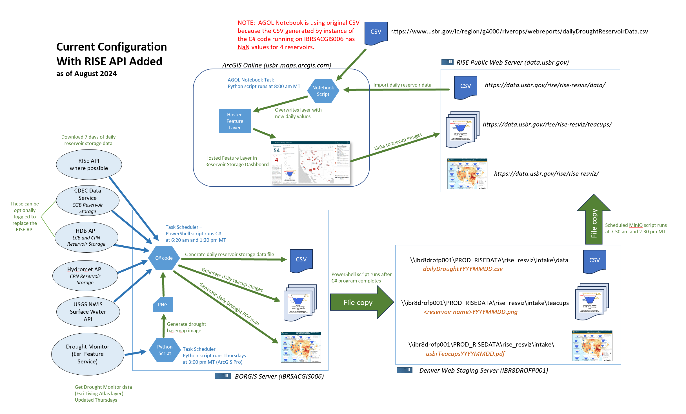

# Teacup Generator

This repository generates reservoir conditions data for the WWDH Reservoir Dashboard and RISE teacup visualizations.

## R Workflow (Current)

**The R workflow is the current production system.** It generates daily CSV files with storage values and historical statistics for 214 western US reservoirs, uploading them to HydroShare for consumption by the WWDH Dashboard.

### Quick Start

```bash
# Run daily generator via Docker
docker run --env-file .env ghcr.io/cgs-earth/rezviz:latest

# Run for a specific date
docker run --env-file .env ghcr.io/cgs-earth/rezviz:latest 2026-02-10
```

### Features

- **214 reservoirs** across the western US
- **4 data sources**: RISE (~191), USACE (6), USGS (6), CDEC (1)
- **Historical statistics** based on 30 water years (1990-2020)
- **Daily CSV output** with storage values, percentiles, and percent full
- **Automated upload** to HydroShare
- **Containerized** for reproducible deployments

### Documentation

See **[R-workflow/readme.md](R-workflow/readme.md)** for complete documentation including:
- Architecture diagram
- Script descriptions
- Data sources and APIs
- Output format specification
- Docker deployment instructions

### Data Output

Daily CSVs are uploaded to HydroShare:
- **Resource**: [hydroshare.org/resource/22b2f10103e5426a837defc00927afbd](https://www.hydroshare.org/resource/22b2f10103e5426a837defc00927afbd/)
- **Period of record**: October 1, 1990 to present (12,917+ files)

---

## .NET Workflow (Deprecated)

> **Note**: The .NET workflow below is deprecated and retained for historical reference. It was previously deployed on the BORGIS server but has been replaced by the R workflow above.

<details>
<summary>Click to expand deprecated .NET documentation</summary>

### Overview

This application aggregates reservoir conditions data to generate the teacup diagrams that are available on the [RISE Reservoir Conditions page](https://data.usbr.gov/visualizations/reservoir-conditions/).

This project consists of the following .NET programs:
- DroughtDataDownloaderV2
- FetchHistoricData
- TeacupV2
- RiseTeacupsLib
- UnitTest
- CalculateStatistics (deprecated)
- DroughtDataDownloader (deprecated)
- Teacup (deprecated)

### DroughtDataDownloaderV2

Command line arguments:
- `startDate` - Required parameter. By default this will be the same as the endDate, but it is here to provide the option for backfilling data if needed.
- `endDate` - Required parameter. Usually defaults to yesterday's date.
- `-r` - Will include RISE as a datasource if provided.
- `-t` - Will use the Test API for all RISE queries.

This program reads the location data from `dataDownload.csv` and retrieves the latest reservoir conditions value for each date between the `startDate` and `endDate` arguments.

For each date between the `startDate` and `endDate` the program will loop through each location and request data for the date and back 7 days. If no valid value is found for the current date, the program will walk backwards through the preceeding week to find the most recent valid value.

The output of this program is a csv file that will be stored in the `datafiles` directory with the file name `droughtData<runDate>.csv`. This output file will include one row for each location, with the latest retrieved value along with statistics calculated using the historical data provided by the FetchHistoricalData program. This program will also calculate the following additional values:
- Percent Median (latest value / 50th percentile)
- Percent Average (latest value / average)
- Percent Full (latest value / max capacity)

If any of these required values fail or do not exist, the program will output `NaN` in its place.

### FetchHistoricalData

Command line arguments:
- `-r` - Will include RISE as a datasource if provided.
- `-t` - Will use the Test API for all RISE queries.

Queries data sources to retrieve the full historical dataset from 10/1/1990 to 9/30/2020.

One JSON file will be created for each location and stored in the `historicalData` directory.

The JSON files will contain key-value pairs, where the key is the result date and the value is the result value.

Data will be overwritten every time this program runs.

This program is configured to run every Sunday via the `runBothTeacupJobs.ps1` Powershell script.

### TeacupV2

An exact copy of the original Teacup program upgraded to .NET version 8

Command line arguments:
- start date
- end date

This program uses the output of the DroughtDataDownloader to generate a set of teacup diagrams and one map for each day in the date range specified by the command line arguments.

The `teacups.cfg` file contains static information used by the program to determine values such as display name and row/column for the generated map.

Additionally, the program also keeps a copy of the most recent map and each individual teacup image with static file names. The map will be called `USBR_Tea_Cup_Current.pdf` and the teacups will be called `<teacup display name>_Current.png`. These files get overwritten each time the program runs.

Output files are stored in the teacups directory.

### RiseTeacupsLib

A class library which holds all data structures and logic shared by the CalculateStatistics and DroughtDataDownloaderV2 programs.

Includes the following classes:
- Location
    - Class for location records from `dataDownload.csv`.
    - Methods for instantiating objects from lines read from `dataDownload.csv`, generating the location's output line for the resulting csv file, and reading statistics from `dataDownloadStats.csv`.
    - Contains a `Stats` and `DataClient`.
- RiseResult
    - Class for holding query results from the RISE API.
- Stats
    - Class for holding the statistical calculation results generated by CalculateStatistics program.
- DataClient
    - Class for wrapping all data fetching and calculations.
    - The `Data` property is a `Dictionary<DateTime, double>` which holds all retrieved data values, with the date of the value as the key.

### UnitTest

Contains unit tests for the project.

Uses two csv files, `dataDownloadTest.csv` and `dataDownloadStatsTest.csv` to mock input data in the other programs.

### CalculateStatistics

** Deprecated, statistical calculations now happen every time DroughtDataDownloaderV2 runs.

### DroughtDataDownloader

** Deprecated, please use DroughtDataDownloaderV2.

### Teacup

** Deprecated, please use TeacupV2.

### Application Architecture Diagram (.NET)



### Repository Structure

This repository is split into two main directories: src and release.

The src directory contains all application code, dependencies, tests, and the associated Visual Studio solution file that can be used to develop and build the .NET programs.

The release directory contains only the files needed to deploy the application to a server:
- `_PROGRAM`
- `runBothTeacupJobs.ps1`

The `_PROGRAM` directory contains the compiled executables for both programs, the output `datafiles` and `teacups` directories, as well as other required files and dependencies.

The `runBothTeacupJobs.ps1` powershell script executes both the DroughtDataDownloaderV2 and TeacupV2 programs via a scheduled task on the server.

Command line arguments for `runBothTeacupJobs` are:
- `startDate` - defaults to yesterday's date
- `endDate` - defaults to yesterday's date
- `-useRise` - include this flag to use the RISE API as a datasource
- `-useTest` - include this flag to use the Test RISE API
- `-runLocal` - include this flag to test the script locally in development

By default, the `runBothTeacupJobs` script should be configured to omit the `startDate` and `endDate` arguments, and include the `-useRise` flag.

### Deployment (.NET)

Deployment for this application is currently a manual process.

This application is deployed to the `IBRSACGIS006` BORGIS server.

To deploy updates, the contents of `release/_PROGRAM` will need to be replaced with the latest versions. This should include the full contents of the `bin/Debug/net8.0` directory within the `DroughtDataDownloaderV2`, `FetchHistoricalData`, `TeacupV2`, and `RiseTeacupsLib` projects.

The `UsbrTeacups.sln` Visual Studio solution file can be used to compile the projects.

NuGet package dependencies can be installed by using the `Update-Package` command in the package manager console in Visual Studio.

The `buildRelease.ps1` powershell script can be used for automating the construction of the `release/_PROGRAM` directory. It requires the .NET CLI to be installed. This script will run through the necessary project directories, remove the old build directory, create a new build, and copy the contents to the `release/_PROGRAM` directory.

When deploying a new version via copying as a zip file, the `runBothTeacupJobs.ps1` file maybe be blocked. To solve this, open PowerShell ISE and run the following command:
- `Unblock-File -Path D:\ScheduledTasks\RISE_Teacups\runBothTeacupJobs.ps1`

</details>
